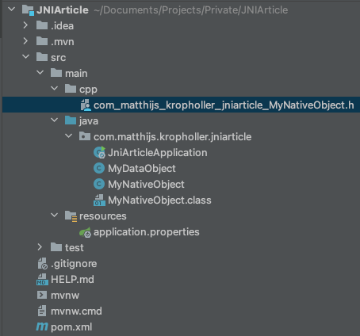
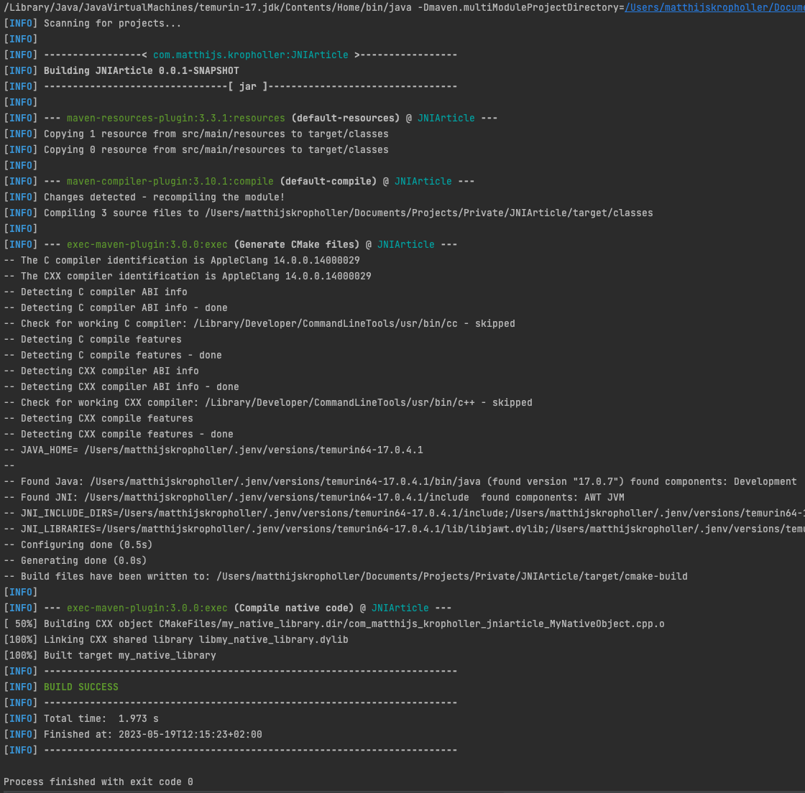
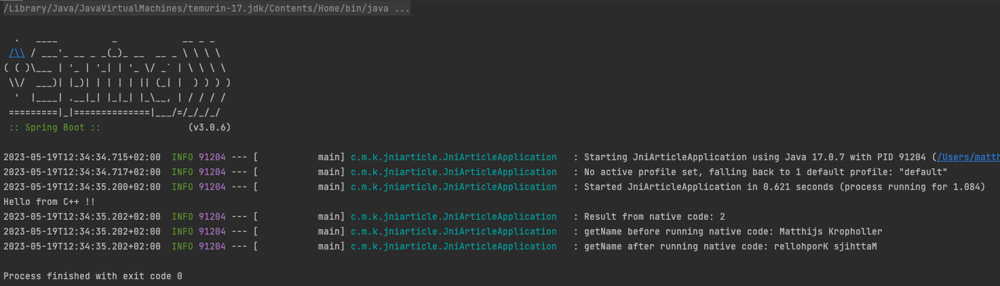

# Calling native code in Java

Java is well-known for its portability. Wherever the Java Virtual Machine (JVM) runs, your code will also run. However, in some instances we might need to call code that’s natively compiled. This could be to interact with a native library, to handle hardware or maybe even to improve performance for an intensive process. There are many reasons why one might consider doing this.

How is this done, you might ask. The Java Development Kit (JDK) has got you covered. 
The JDK provides a method called Java Native Interface (JNI) to bridge the gap between the bytecode running in the JVM and whatever native code you need to interact with.

## So. How does it work?

First things first, the native code has to be loaded in as a shared library. 
To keep it simple, a shared library is an external file that contains native code that is loaded into a program on startup so that the program may call its methods. 
You might have seen these files before. On Windows machines they have the “.dll” extension and on Linux they have the “.so” extension.
In this article we will create a simple shared library and how to call it from your Java program.

What do we need?
- Java
- C/C++ compiler (gcc)
- CMake

### Step 1: Java
Create a Java project as you would normally. Afterwards, load the library through a static block. This ensures that the library will be loaded if it can be found. Keep in mind that since it’s trying to load the library file in a static block, the program won’t be able to start without it. Alternatively, the shared library can be loaded anywhere in our application but this is my preferred method as you ensure that the library is loaded.

```java
@SpringBootApplication
public class JniArticleApplication implements CommandLineRunner {
    static {
        final String userDirectory = System.getProperty("user.dir"); // This will get the current working folder.
        final String sharedLibsDirName = "sharedlibs"; // The directory where our shared library is stored
        final String sharedLibraryName = System.mapLibraryName("my_native_library"); // This will map the library name to the platform specific name. on MacOS this will become libmy_native_library.dylib

        // The program will not start if it cannot find the library
        System.load(Paths.get(userDirectory, sharedLibsDirName,sharedLibraryName).toString());
    }
}
```
Next, create two new classes. One that will house you native methods and one that will be used as a data class.

First we will start with the data class as it's the easiest. In our example we will create a simple class that holds a string.

```java
public class MyDataObject {
    private String name;

    public String getName() {
        return name;
    }

    public void setName(String name) {
        this.name = name;
    }
}
```

Afterward we will create a class that houses the native methods.

```java
public class MyNativeObject {
    public native void printToStdOut();
    public native int addNumbers(int number1, int number2);
    public native void manipulateData(MyDataObject dataObject);
}
```
This class looks familiar to something quite familiar in the Java world, abstract methods. Instead of the “abstract” keyword, the “native” keyword will be used, and this is where the magic will begin. In the next section we will use a tool that goes through our file and creates a C/C++ header file.

### Step 2: Preparing our C++ code
Now that we have written the Java code, we will use **javac** to generate the header files. This will be our second step to gluing together the Java and C++ code. For simplicity’s sake we will incorporate the header generation part in our build by adding the following under the plugin section in the maven POM.

```xml
<plugin>
    <!-- This plugin will call javac -->
    <artifactId>maven-compiler-plugin</artifactId>
    <configuration>
        <compilerArgs>
            <arg>-h</arg> <!-- the "h" flag will generate header files -->
            <arg>src/main/cpp</arg> <!-- the location of where we want the header files stored -->
        </compilerArgs>
    </configuration>
</plugin>
```

Now we will run a build and we should see the “cpp” folder in our project. In that folder we should find a generated header file.



When this file is opened we will see the following:

```cpp
/* DO NOT EDIT THIS FILE - it is machine generated */
#include <jni.h>
/* Header for class com_matthijs_kropholler_jniarticle_MyNativeObject */

#ifndef _Included_com_matthijs_kropholler_jniarticle_MyNativeObject
#define _Included_com_matthijs_kropholler_jniarticle_MyNativeObject
#ifdef __cplusplus
extern "C" {
#endif
/*
 * Class:     com_matthijs_kropholler_jniarticle_MyNativeObject
 * Method:    printToStdOut
 * Signature: ()V
 */
JNIEXPORT void JNICALL Java_com_matthijs_kropholler_jniarticle_MyNativeObject_printToStdOut
  (JNIEnv *, jobject);

/*
 * Class:     com_matthijs_kropholler_jniarticle_MyNativeObject
 * Method:    addNumbers
 * Signature: (II)I
 */
JNIEXPORT jint JNICALL Java_com_matthijs_kropholler_jniarticle_MyNativeObject_addNumbers
  (JNIEnv *, jobject, jint, jint);

/*
 * Class:     com_matthijs_kropholler_jniarticle_MyNativeObject
 * Method:    manipulateData
 * Signature: (Lcom/matthijs/kropholler/jniarticle/MyDataObject;)V
 */
JNIEXPORT void JNICALL Java_com_matthijs_kropholler_jniarticle_MyNativeObject_manipulateData
  (JNIEnv *, jobject, jobject);

#ifdef __cplusplus
}
#endif
#endif

```

Javac automatically generated functions based on the methods that we qualified as “native” earlier as well as the class it belongs to and the package name. Looking closer at the generated functions you can see a few things that might look weird on first view. Our integers got turned into “jint”. Why do all our functions have “JNIEnv*” and “jobject” even if the original Java function did not have any arguments? More confusingly, what does “JNIEXPORT” and “JNICALL” even mean?

Let's start with the ones that are the easiest to explain. “jint” and “jobject” The “jint” is a C/C++ representation of a Java integer type. 
“jobject” does the same but for a Java object instead. The first “jobject” argument you will see in a function represents the object itself, 
like how'd you use “this” in Java to refer to a method or field within a class. Now for the ones that are a little bit more complicated to explain. 
JNIEnv* is a pointer to the Java Native Interface environment. From here you can interact with Java, it is possible to access methods of objects, initialize new objects, etc. 
“JNIEXPORT” and “JNICALL” combined make it possible to actually call the function from Java. JNIEXPORT ensures that the function will be placed on the functions table so that JNI can find it. 
JNICALL ensures that the exported function will be available to JNI so that it can be called from within our Java application.

All of these types and compiler macros come from the “jni.h” header file which we can see at the top of our generated header file.

Now all we have is a header file. Let’s create a .cpp file to implement the generated header. Create a **.cpp** file, preferably with the name same as our generated **.h** file in the **src/main/cpp** folder. In my case this is **com_matthijs_kropholler_jniarticle_MyNativeObject.cpp**.

Next, we will implement the C++ methods.
```cpp
#include "com_matthijs_kropholler_jniarticle_MyNativeObject.h"
#include <iostream> // this is required for std::cout
#include <string> // This is required for std::string
#include <algorithm> // this is required for std::reverse


JNIEXPORT void JNICALL Java_com_matthijs_kropholler_jniarticle_MyNativeObject_printToStdOut (JNIEnv* javaEnv, jobject thisJavaObject) {
     std::cout << "Hello from C++ !!" << std::endl; // This will write "Hello from C++ !!" to std out (likely a terminal)
}

JNIEXPORT jint JNICALL Java_com_matthijs_kropholler_jniarticle_MyNativeObject_addNumbers (JNIEnv * javaEnv, jobject thisJavaObject, jint number1, jint number2) {
    return number1 + number2; // Add the numbers together
}

JNIEXPORT void JNICALL Java_com_matthijs_kropholler_jniarticle_MyNativeObject_manipulateData(JNIEnv* javaEnv, jobject thisJavaObject, jobject myJavaDataObject) {
    // Get the Java class of the object because we are going to need to get the method ids
    jclass myDataObjectClass = javaEnv->GetObjectClass(myJavaDataObject);

    // In order to call a Java method. we need the method ids of the methods we are trying to call
    jmethodID getNameMethodId =javaEnv->GetMethodID(myDataObjectClass, "getName", "()Ljava/lang/String;"); // the 2nd argument is the return type
    jmethodID setNameMethodId =javaEnv->GetMethodID(myDataObjectClass, "setName", "(Ljava/lang/String;)V"); // the 2nd argument is the argument of type String and return type void

    // This is basically the same as calling "getName" on an instance of the DataObject class.
    jstring rawJavaString = (jstring)javaEnv->CallObjectMethod(myJavaDataObject, getNameMethodId);

    // Convert the C++ representation of a Java string to a regular C++ string so that we can perform operations on it.

    // Get the raw string
    jboolean isCopy;
    const char* utfChars = javaEnv->GetStringUTFChars(rawJavaString, &isCopy);
    // Put the raw string in a C++ string object. std::string will take care of the string's life cycle. We do not need to delete the data once we are done with it.
    // When the string leaves its defined scope, it will automatically be cleaned up.
    std::string nativeString(utfChars);
    // Since we have copied the contents of the original string we need to release it so that we don't leak memory
    javaEnv->ReleaseStringUTFChars(rawJavaString, utfChars);

    // Now that we got our hands onto a native string, we can do some operations on it. For simplicity sake we will just reverse the string.
    std::reverse(nativeString.begin(), nativeString.end());

    // After our native operation, let's put the data back onto our Java object.
    // Here we call a void method on our instance of DataObject and we call "setName". As argument we give it a new Java string
    javaEnv->CallVoidMethod(myJavaDataObject, setNameMethodId, javaEnv->NewStringUTF(nativeString.c_str()));
}
```

### Step 3: Compiling our C++ code
Now that we have our generated code we will need to compile it. We will use CMake since it's very popular in the C/C++ world, and for good reason too.
One of CMake's main advantages is that it will generate platform specific makefiles and its compatible with a multitude of compilers.

In our **cpp** folder. Where we house all our c++ things, create a new file called **CMakeLists.txt**. This file will contain our CMake instructions.

```cmake
cmake_minimum_required(VERSION 3.20)
project(my_native_library)

# Set C++ 17 as teh standard
set(CMAKE_CXX_STANDARD 17)

# Print our JAVA_HOME in the console when we run CMake to help identifying problems with our java home.
message(STATUS "JAVA_HOME= $ENV{JAVA_HOME}")
message(STATUS "")

# Next we set some variables that the JNI package needs to load in
# Here is how its done on MacOS and Linux

# If Linux
if(UNIX AND NOT APPLE)
    set(JAVA_AWT_LIBRARY "$ENV{JAVA_HOME}/lib/libjawt.so")
    set(JAVA_JVM_LIBRARY "$ENV{JAVA_HOME}/lib/server/libjvm.so")
    set(JAVA_INCLUDE_PATH2 "$ENV{JAVA_HOME}/include/linux")
endif()

# if MacOS
if(UNIX AND APPLE)
    set(JAVA_AWT_LIBRARY "$ENV{JAVA_HOME}/lib/libjawt.dylib")
    set(JAVA_JVM_LIBRARY "$ENV{JAVA_HOME}/lib/server/libjvm.dylib")
    set(JAVA_INCLUDE_PATH2 "$ENV{JAVA_HOME}/include/darwin")
endif()

set(JAVA_INCLUDE_PATH "$ENV{JAVA_HOME}/include")
set(JAVA_AWT_INCLUDE_PATH "$ENV{JAVA_HOME}/include")

# While running CMake, this will create a folder called "sharedlibs" in the root of our project.
file(MAKE_DIRECTORY "${CMAKE_SOURCE_DIR}/../../../sharedlibs")

# This will load in external packages that we need to get JNI to work
find_package(Java COMPONENTS Development)
find_package(JNI REQUIRED)

if (JNI_FOUND)
    message (STATUS "JNI_INCLUDE_DIRS=${JNI_INCLUDE_DIRS}")
    message (STATUS "JNI_LIBRARIES=${JNI_LIBRARIES}")
endif()

include_directories(.)

# This will load all C++ code files onto variables so that we can link it to a target
file(GLOB HEADER_LIST CONFIGURE_DEPENDS "${PROJECT_SOURCE_DIR}/*.h")
file(GLOB SOURCE_LIST CONFIGURE_DEPENDS "${PROJECT_SOURCE_DIR}/*.cpp")

# link the code files onto our target. "shared" is important here, this is the magic that will make it so our compiled code comes out as a shared library.
add_library(my_native_library SHARED ${HEADER_LIST} ${SOURCE_LIST})

# Next we need to link JNI to our target
target_link_libraries(my_native_library PRIVATE JNI::JNI)

# After our build, copy the compiled shared library to our shared libs folder.
add_custom_command(TARGET my_native_library
        POST_BUILD
        COMMAND ${CMAKE_COMMAND} -E copy $<TARGET_FILE:my_native_library> "${CMAKE_SOURCE_DIR}/../../../sharedlibs/")
```

Now we need to call CMake, and preferably we would want this within our Maven lifecycles. Luckily, this can be done through plugins.
A plugin called **exec-maven-plugin** is crucial in this. Add the following to your Maven POM.

```xml
<plugin>
    <!-- This plugin allows to execute programs -->
    <!-- To compile our shared library 2 things need to be done. 1. Generate CMake files. 2. Execute the generated files -->
    <groupId>org.codehaus.mojo</groupId>
    <artifactId>exec-maven-plugin</artifactId>
    <version>3.1.0</version>
    <executions>
        <execution>
            <!-- Step 1. Generate the CMake files -->
            <id>Generate CMake files</id>
            <!-- Run before compile -->
            <phase>compile</phase>
            <goals>
                 <!-- This tells the plugin to execute the program -->
                <goal>exec</goal>
            </goals>
            <configuration>
                <executable>cmake</executable>
                <workingDirectory>src/main/cpp</workingDirectory>
                <arguments>
                    <argument>-S</argument> <!-- argument to tell cmake where the source dir of the CMakelists.txt file is -->
                    <argument>.</argument> <!-- current folder (src/main/cpp) -->
                    <argument>-B</argument> <!-- argument to tell cmake where it should place the generated files -->
                    <argument>../../../target/cmake-build</argument> <!-- a new folder "cmake-build" in the "target" folder -->
                </arguments>
            </configuration>
        </execution>
        <execution>
            <!-- Step 2. Run the generate cmake files (compile & link native code) -->
            <id>Compile native code</id>
            <phase>compile</phase>
            <goals>
                <goal>exec</goal>
            </goals>
            <configuration>
                <!-- CMake generates makefiles so we can just run make in the "cmake-build" folder -->
                <executable>make</executable>
                <workingDirectory>target/cmake-build</workingDirectory>
            </configuration>
        </execution>
    </executions>
</plugin>
```

As a bonus, we would want to clear our compiled artifacts when we run the Maven "clean" command. For that to work, add the following plugin to your Maven POM.
```xml
<plugin>
    <!-- This plugin removes the "sharedlibs" folder from the root of our project once we run a Maven clear -->
    <artifactId>maven-clean-plugin</artifactId>
    <configuration>
        <filesets>
            <fileset>
                <directory>${basedir}/sharedlibs</directory>
            </fileset>
        </filesets>
    </configuration>
</plugin>
```

Now that we have wired up our toolchain. Let's run Maven "compile". You should see something similar to this in your console.


And voilà! You have compiled a native shared library at the same time as your Java code. After you have ran this, you should see a new folder in the root of your project.
The compiled library should be in there.


### Step 4: Calling our native code from Java.
It took a bit of preparation but the finish line is in sight. We have combined our C++ toolchain with Maven, we have the ability to generate header files, and we can compile our code.
The project is set up in a way that allows you to freely add native methods to Java classes and their subsequent C++ implementations.

Now we will call our native code in Java. Open your main class and add the following code.

```java
var nativeObject = new MyNativeObject();

nativeObject.printToStdOut();

int result = nativeObject.addNumbers(1, 1);
logger.info("Result from native code: {}", result);

MyDataObject dataObject = new MyDataObject();
dataObject.setName("Matthijs Kropholler");

logger.info("getName before running native code: {}", dataObject.getName());
nativeObject.manipulateData(dataObject);
logger.info("getName after running native code: {}", dataObject.getName());
```

In the associated repository to this article, the final result looks like the following:
```java
package com.matthijs.kropholler.jniarticle;

import org.slf4j.Logger;
import org.slf4j.LoggerFactory;
import org.springframework.boot.CommandLineRunner;
import org.springframework.boot.SpringApplication;
import org.springframework.boot.autoconfigure.SpringBootApplication;

import java.nio.file.Paths;

@SpringBootApplication
public class JniArticleApplication implements CommandLineRunner {
    Logger logger = LoggerFactory.getLogger(JniArticleApplication.class);

    static {
        final String userDirectory = System.getProperty("user.dir"); // This will get the current working folder.
        final String sharedLibsDirName = "sharedlibs"; // The directory where our shared library is stored
        final String sharedLibraryName = System.mapLibraryName("my_native_library"); // This will map the library name to the platform specific name. on MacOS this will become libmy_native_library.dylib

        // The program will not start if it cannot find the library
        System.load(Paths.get(userDirectory, sharedLibsDirName,sharedLibraryName).toString());
    }

    public static void main(String... args) {
        SpringApplication.run(JniArticleApplication.class, args);
    }

    @Override
    public void run(String... args) throws Exception {
        var nativeObject = new MyNativeObject();

        nativeObject.printToStdOut();

        int result = nativeObject.addNumbers(1, 1);
        logger.info("Result from native code: {}", result);

        MyDataObject dataObject = new MyDataObject();
        dataObject.setName("Matthijs Kropholler");

        logger.info("getName before running native code: {}", dataObject.getName());
        nativeObject.manipulateData(dataObject);
        logger.info("getName after running native code: {}", dataObject.getName());
    }
}
```

When we run our application we see the following.


Congratulations, you have successfully called native C++ code from within your Java program.

## Final words
This article provides a simple example on how to call C++ code from Java and also Java code from C++. 
This however, might not be representable to a real world scenario since it's unlikely that a real world scenario is as simple as this is.
A few other things that have to be noted are performance and complexity. 

As you saw, it is quite complex to set this up compared to an all-Java project, even for a simple example like this is.
Performance is also an important factor. Calling native methods is not "free" performance. JNI is quite useful for things Java cannot do but C/C++ can or to optimize a long-running process that is incredibly slow in Java. 
But it's unsuitable for simple usage like shown in this article because communicating between Java and Native code has a cost associated to it.

Adding a stopwatch in our code to benchmark the calls shows the following on an M1 Pro:

```
---------------------------------------------
ns         %     Task name
---------------------------------------------
000011917  033%  native code AddNumbers
000000208  001%  java code AddNumbers
000015208  042%  native code Reverse String
000009084  025%  java code Reverse String
```
As you can see, the native methods are measurably slower than the Java variants are.

That being said, I believe that JNI definitely has its usages even if they are not common and I hope that this article may be used to get someone started with JNI.